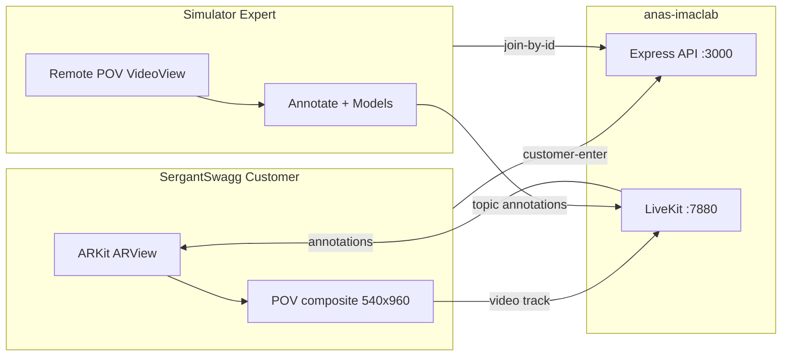

# m2m — Native Customer/Expert switch (iOS first)

## Locked decisions (from you)

| Decision | Choice |
|----------|--------|
| Session shape | Customer publishes POV; Expert views video + annotates / models / transforms (no expert AR) |
| App model | **One Instant app** — home toggle Customer ↔ Expert |
| Expert gate | Only `profiles.role` in `{expert, admin}` |
| Mode switch | **Home only** (disabled in-call) |
| Join | Expert enters customer public ID → Join (Figma) |
| Platforms | iOS ↔ iOS first |
| Lab runtime | **anas-imaclab** Docker LiveKit + Express API (Mac Mini offline; **no expert-web**) |
| Test accounts | Customer phone: `stoicgreek2006@gmail.com` / ID `8-248-004-9853` · Expert Simulator: `legendaryhercule786@gmail.com` |
| Expert tools | Same as web Active Session: arrow, freehand, undo/clear, models load/place/transform/remove, mic/speaker, end |

Figma references (saved in workspace):
- Customer home (toggle off): [`assets/iPhone_16_-_2-89f6a47c-6f62-4ea5-99c7-9562d723e10e.png`](/Users/admin/.cursor/projects/Users-admin-SyedMohammadAnas-projects-GGSApple/assets/iPhone_16_-_2-89f6a47c-6f62-4ea5-99c7-9562d723e10e.png)
- Expert home (toggle on): [`assets/iPhone_16_-_3-bb8d18eb-4436-4895-b76c-832eb37f291d.png`](/Users/admin/.cursor/projects/Users-admin-SyedMohammadAnas-projects-GGSApple/assets/iPhone_16_-_3-bb8d18eb-4436-4895-b76c-832eb37f291d.png)



## Phase 0 — Commit + branch

1. On `main`, commit only vault-sync repo files: [`.cursor/rules/ggsapple.mdc`](.cursor/rules/ggsapple.mdc), [`.cursor/rules/punctualities.mdc`](.cursor/rules/punctualities.mdc), [`docs/learnings.md`](docs/learnings.md).
   **Exclude:** `expert-web/.env.local`, `EXECUTIVE-SUMMARY.md`, `move-around.svg`, nested `expert-web/` tree.
2. Create and checkout branch **`m2m`** from that commit.
3. Vault (Obsidian MCP): Progress note + hub/topic latest lines stating `m2m` + iMac Lab local stack for this experiment.

## Phase 1 — Local media/control on anas-imaclab

Express already has the routes we need: [`backend/src/routes/sessions.ts`](backend/src/routes/sessions.ts) (`POST /join-by-id`, `POST /customer-enter`, end/status). Compose is profile-gated:

```bash
# From monorepo root on iMac Lab
# 1) Point livekit.yaml node_ip + turn.domain at iMac Tailscale 100.83.95.8 (today still Homelab 100.70.151.71)
# 2) Ensure .env has Supabase + LIVEKIT_URL=ws://100.83.95.8:7880 (or wss if Serve added later)
docker compose --profile api up -d --build
curl -s http://127.0.0.1:3000/health
```

Client Debug defaults for this branch:
- API: `http://100.83.95.8:3000` (phone on Tailscale; Simulator can use host IP or Tailscale)
- LiveKit: `ws://100.83.95.8:7880` for lab (or WSS via Tailscale Serve if mixed-content / ATS requires it — verify on device; bump `configEpoch` when baking)

Also verify in Supabase (MCP): expert account email maps to `profiles.role` = `admin` or `expert` (user wrote `legendaryhercule786@gmail.com` — confirm exact email vs vault seed `legendaryhercules786@gmail.com`).

## Phase 2 — Home: gated mode switch (Figma)

Touch: [`HomeView.swift`](ios-app/GGSApple/Home/HomeView.swift), [`HomeViewModel.swift`](ios-app/GGSApple/Home/HomeViewModel.swift), [`SessionService.swift`](ios-app/GGSApple/Networking/SessionService.swift), [`AuthService.swift`](ios-app/GGSApple/Auth/AuthService.swift) (`Profile.role`).

- Restore `AppMode.customer | .expert`.
- Header toggle (off = Customer, on/orange = Expert) matching Figma; **hidden or disabled** if `profile.role` not in `{expert, admin}` (customers never see a working Expert path).
- Persist preferred mode in `UserDefaults` for eligible users; force `.customer` if role is not expert/admin.
- **Customer body** (toggle off): copy aligned to Figma — “Share your ID…”, Your ID + copy, Share CTA, Create video tutorial secondary.
- **Expert body** (toggle on): “Enter customer ID…”, paste field, **Join the session** → `SessionService.joinById(targetPublicId:)`.
- Home-only: ignore toggle changes while `activeCall != nil`.

API hardening: gate `POST /api/sessions/join-by-id` so only expert/admin profiles succeed (UI gate alone is not enough).

## Phase 3 — Expert call surface (Simulator-safe)

New expert call UI (prefer dedicated `ExpertCallView` rather than forcing AR into Simulator):

| Concern | Approach |
|---------|----------|
| Media | Subscribe to customer remote video only; optional mic publish; **no** ARSession / POV encoder |
| Overlay | Full-bleed `VideoView` + transparent hit canvas for tools (port web tool semantics) |
| Wire | LiveKit topic `annotations`, `role: "expert"` — reuse existing customer `applyRemoteWireEvent` path in [`OfflineAssistSessionView.swift`](ios-app/GGSApple/SoloAR/OfflineAssistSessionView.swift) |
| Tools | Arrow, freehand begin/point/end, undo/clear, pointer optional |
| Models | Load catalog from API `/assets` or models route; emit `load_model` / `place_model` / `transform` / `remove_model`; finger drag/pinch for transform on selected model |
| Lifecycle | `session_end` + `POST .../end`; leave on peer end / status ≠ active |
| LiveKitManager | Expert connect path: subscribe + data; do not call `captureARFrame` / buffer publish |

Customer path on SergantSwagg stays current [`CallView.swift`](ios-app/GGSApple/Call/CallView.swift) POV publish (`streamMode: .customerPOV`).

## Phase 4 — Build + guided test (your hands)

Agent cannot drive the physical device UI; after code is ready:

1. Build/run **Customer** on **SergantSwagg** (attached) — sign in `stoicgreek2006@gmail.com`, Debug URL → iMac API + LiveKit, toggle **off**, leave home waiting.
2. Build/run **Expert** on **Simulator** — sign in expert Google account, Debug URL → same iMac endpoints, toggle **on**, enter `82480049853` / formatted `8-248-004-9853`, Join.
3. Verify matrix: POV video on Simulator → arrow/freehand appear in customer AR → model place/move → mute/end both sides → both return home.
4. Written step sheet in chat after build (ATS, Tailscale on phone, Simulator host networking, common failures).

## Phase 5 — Vault log (mandatory, same session)

Obsidian MCP:
- `Projects/GGSApple/Progress/m2m-Native-Expert-Switch-YYYY-MM-DD.md` with `Parent: [[Projects/GGSApple/Runs/iOS-Live]]` (or Meta if branch-only)
- Update Runs hub latest line + GGSApple Current focus row for `m2m`
- Note lab stack = iMac Lab for this experiment; Mac Mini remains production-lab default when online

## Explicit non-goals (this branch milestone)

- Android m2m / Android annotation wire unification
- expert-web / Vercel changes
- Peer dual-AR
- Mid-call role flip
- Production LiveKit Cloud cutover

## Risk watchlist

- `livekit.yaml` still points at Homelab IP — must retarget to iMac or ICE fails on Tailscale.
- ATS may block cleartext `http://` / `ws://` on device — may need App Transport exception for lab IP or Tailscale Serve HTTPS/WSS.
- Expert Simulator needs a **real** second Google login (already confirmed).
- Model catalog downloads must reach iMac `:3000` from both phone and Simulator.
