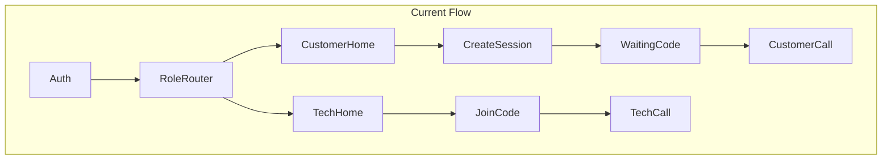
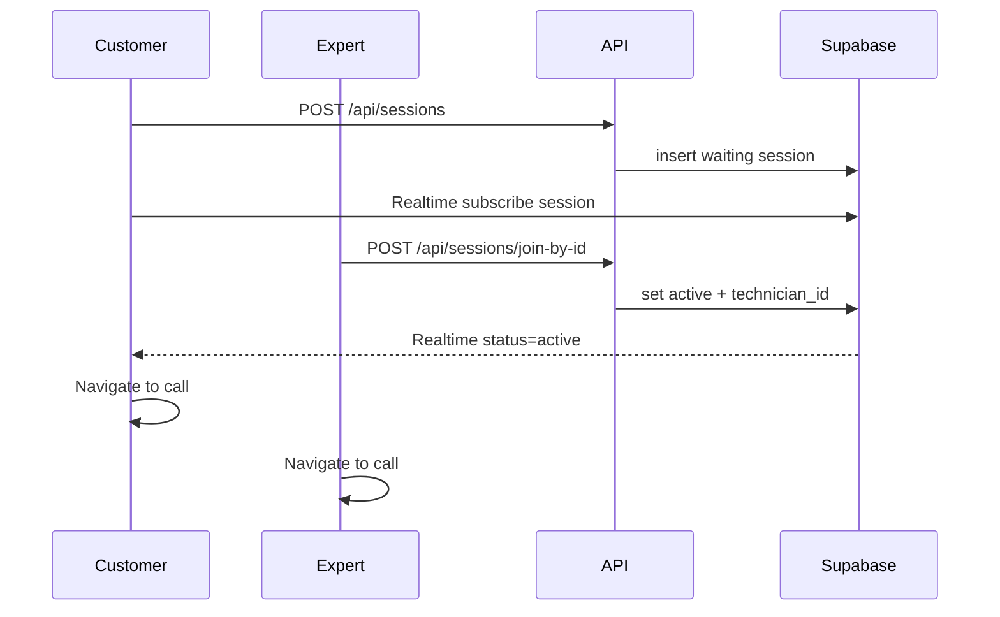

# Premium / Free Split, ID Joining, and Home Revamp

## Current baseline (premium)

The [`android-app/`](android-app/) Kotlin app on `master` is the **premium** product: LiveKit calls, ARCore, bidirectional annotations, chat, file sharing, session recording, asset library UI, speaker/mute/pause, and glass call chrome ([`AssistCallUi.kt`](android-app/app/src/main/kotlin/com/cgsapple/remotear/ui/call/AssistCallUi.kt)). Session join today uses **6-char codes** via [`SessionApiService.kt`](android-app/app/src/main/kotlin/com/cgsapple/remotear/data/remote/SessionApiService.kt) and separate [`CustomerHomeScreen`](android-app/app/src/main/kotlin/com/cgsapple/remotear/ui/home/HomeScreens.kt) / [`TechnicianHomeScreen`](android-app/app/src/main/kotlin/com/cgsapple/remotear/ui/home/HomeScreens.kt) routed by `profiles.role`.



---

## Git / repo strategy

| Branch | Purpose | Maintenance |
|--------|---------|-------------|
| **`master`** (premium) | Full pro app + new home/ID UX + video tutorial | Primary development |
| **`free`** | Core app: session + annotations + full 3D library/placement + home/ID UX + video tutorial | Cut from tagged baseline; strip collaboration pro features only |

**Actions:**
1. Tag current premium state: `v0.9.0-premium-baseline` (before large UX refactor).
2. After premium work ships, tag `v1.0.0-premium` and create `free` from that commit.
3. Add [`docs/NativeRework/branching-strategy.md`](docs/NativeRework/branching-strategy.md) (merge policy, which branch gets backend fixes, release tags).
4. Add [`docs/NativeRework/feature-matrix.md`](docs/NativeRework/feature-matrix.md) — authoritative free vs premium list (see matrix below).

**Gradle build dimension (both branches):** add `productFlavors` `premium` / `free` with `BuildConfig.IS_PREMIUM` so one tree can emit both APKs on `master`; the `free` **git branch** keeps only free-relevant code paths to reduce drift. Document both approaches in branching doc.

---

## Feature matrix (new doc)

**Shared core (built once, ships in both premium and free):** unified home, 11-digit ID join, annotations, full 3D model library + placement, local video tutorial, debug backend URL, safe areas.

**Premium-only (stripped in free):** in-session chat, file sharing, in-call session recording, session options panel, speaker routing / video pause, legacy 6-char join code fallback.

| Feature | Premium (`master`) | Free (`free`) |
|---------|-------------------|---------------|
| Google auth | Yes | Yes |
| Unified home + customer/expert toggle | Yes | Yes |
| 11-digit personal ID + ID-based join | Yes | Yes |
| LiveKit AV call | Yes | Yes |
| ARCore customer camera | Yes | Yes |
| Annotation tools (pointer, arrow, draw, circle, undo, delete) | Yes | Yes |
| **3D model library** (search, recents, thumbnails) | Yes | **Yes** |
| **3D model placement** (AR anchor + sync) | Yes | **Yes** |
| **Local video tutorial** (offline AR + save recording to phone) | Yes | **Yes** |
| Debug backend URL override | Yes | Yes |
| Safe area / inset-aware layout | Yes | Yes |
| In-session chat | Yes | **No** |
| File sharing (Supabase Storage) | Yes | **No** |
| In-call session recording | Yes | **No** |
| Session options panel (recording/chat/files) | Yes | **No** |
| Speaker routing / video pause | Yes | Basic mute + end only |
| Legacy 6-char join code | Optional fallback (premium only) | **No** |

---

## Documentation deliverables ([`docs/NativeRework/`](docs/NativeRework/))

| File | Action |
|------|--------|
| [`progress.md`](docs/NativeRework/progress.md) | Add Phase 6 premium completion (call UI, chat/files bucket, annotation fixes, device installs) |
| [`app-flow.md`](docs/NativeRework/app-flow.md) | Rewrite for unified home, ID join, incoming-session UX, video tutorial |
| [`backend-schema.md`](docs/NativeRework/backend-schema.md) | Add `profiles.public_id`, new join endpoint, keep legacy `join_code` for premium |
| [`prd.md`](docs/NativeRework/prd.md) | Add premium vs free product tiers |
| [`ux-design.md`](docs/NativeRework/ux-design.md) | Home mockup specs (dark `#0D1117`, orange CTA `#FF6B00`, App Preview hero) |
| **New** `feature-matrix.md` | Table above + call-screen differences |
| **New** `branching-strategy.md` | Branches, tags, flavors, merge rules |
| **New** `debug-backend-url.md` | How team pastes Cloudflare tunnel URLs without rebuild |
| **New** `premium-phase6-summary.md` | Snapshot of everything built through current premium milestone |
| [`learnings.md`](docs/NativeRework/learnings.md) | Safe-area edge-to-edge, pointer gesture fix, ID join notes |

---

## Shared backend (one Docker stack for both branches)

Backend changes are **required** for 11-digit IDs. Single API serves premium + free.

### Supabase migration (via MCP `apply_migration`)

```sql
-- profiles.public_id: 11 numeric digits, unique, auto-assigned
ALTER TABLE profiles ADD COLUMN public_id char(11) UNIQUE;
-- trigger on insert: generate + collision retry
-- backfill existing rows
```

Display format in app: **`X-XXX-XXX-XXX`** (11 digits + dashes for readability; storage is plain 11 chars).

### New / updated API ([`backend/src/routes/sessions.ts`](backend/src/routes/sessions.ts))

| Endpoint | Purpose |
|----------|---------|
| `POST /api/sessions` | Unchanged — customer creates `waiting` session |
| **`POST /api/sessions/join-by-id`** | Body `{ targetPublicId: "12345678901" }` — resolve profile → find customer's `waiting` session → set `active`, mint LiveKit token |
| `POST /api/sessions/:joinCode/join` | **Keep for premium** backward compat |
| **`GET /api/users/me`** (optional) | Return `{ publicId, displayName, email }` |

Validation mirrors existing join: 404 no session, 409 already joined, 400 self-join, 410 ended.

### Incoming session signal

Customer waiting UI subscribes to Supabase Realtime on `sessions` row (`status`, `technician_id`) — when expert joins, show **"Expert is joining your session…"** banner (replaces join-code-centric copy).

### Containers

After backend changes: `docker compose build api && docker compose up -d` ([`docker-compose.yml`](docker-compose.yml)). LiveKit unchanged. Document tunnel steps in [`debug-backend-url.md`](docs/NativeRework/debug-backend-url.md) referencing [`scripts/cloudflare-tunnel.md`](scripts/cloudflare-tunnel.md).



---

## Android — shared implementation (both tiers)

Build all core features on `master` first. The `free` flavor/branch only removes collaboration pro UI and code paths — **not** home UX, video tutorial, or model library.

### 1. Unified home screen (replace dual homes)

**New files:** `ui/home/AssistHomeScreen.kt`, `HomeViewModel.kt`, `HomeUiState.kt`

**Layout (match mockups + [`App_Preview.png`](App_Preview.png)):**
- Full black/dark background (`Background` `#0D1117`)
- Top bar: AR Assist logo + title; **customer/expert toggle** (top-right); kebab menu (sign out, debug settings)
- Center: `App_Preview.png` copied to `res/drawable/app_preview.png`
- **Customer mode:** subtitle "Share your ID…", formatted ID field + copy icon, orange **Share your ID** (starts session + share intent), secondary **Create video tutorial**
- **Expert mode:** subtitle "Enter customer ID…", 11-digit input with paste chip, orange **Join the session**
- **Bottom status bar:** connection readiness (green/yellow/red dot + label), Wi-Fi strength icon, battery level/charging icon — poll via `ConnectivityManager` + `BatteryManager`

**Navigation change:** [`AuthenticatedNavGraph.kt`](android-app/app/src/main/kotlin/com/cgsapple/remotear/ui/navigation/AuthenticatedNavGraph.kt) — single `Routes.HOME` start; remove role-based `CUSTOMER_HOME` / `TECHNICIAN_HOME` split. Toggle persisted in DataStore (`AppModeStore`).

**Profile model:** add `publicId` to [`Profile.kt`](android-app/app/src/main/kotlin/com/cgsapple/remotear/data/model/Profile.kt); fetch from Supabase `profiles.public_id`.

### 2. ID-based session join

- [`SessionApiService.kt`](android-app/app/src/main/kotlin/com/cgsapple/remotear/data/remote/SessionApiService.kt): `joinSessionByPublicId(publicId)`
- Expert home: validate 11 digits → join → navigate directly to `TechnicianCallScreen` (drop separate [`JoinSessionScreen`](android-app/app/src/main/kotlin/com/cgsapple/remotear/ui/session/JoinSessionScreen.kt) or fold into home)
- Customer: **Share your ID** → `POST /api/sessions` → [`WaitingScreen`](android-app/app/src/main/kotlin/com/cgsapple/remotear/ui/session/WaitingScreen.kt) showing ID + incoming expert message (not join code)
- Share intent includes formatted ID string

### 3. Safe area / edge-to-edge fix

[`MainActivity.kt`](android-app/app/src/main/kotlin/com/cgsapple/remotear/MainActivity.kt) keeps `enableEdgeToEdge()` but all screens apply:

```kotlin
Modifier.safeDrawingPadding() // or Scaffold(contentWindowInsets = WindowInsets.safeDrawing)
```

Apply to: home, waiting, call chrome ([`AssistCallUi.kt`](android-app/app/src/main/kotlin/com/cgsapple/remotear/ui/call/AssistCallUi.kt)), auth, session sheets. Replace hard-coded top/bottom `padding(16.dp)` with inset-aware padding.

### 4. Debug backend URL (no rebuild for tunnel rotation)

**New:** `data/local/RuntimeConfigStore.kt` (DataStore)

Fields: `apiUrlOverride`, `livekitUrlOverride` (nullable; fallback to `BuildConfig`).

**New:** `DebugSettingsSheet` in kebab menu — two text fields + Save + Reset.

Wire [`SessionApiService`](android-app/app/src/main/kotlin/com/cgsapple/remotear/data/remote/SessionApiService.kt), [`ModelsApiService`](android-app/app/src/main/kotlin/com/cgsapple/remotear/data/remote/ModelsApiService.kt), and [`CallViewModel.startLiveKitIfReady`](android-app/app/src/main/kotlin/com/cgsapple/remotear/ui/session/CallViewModel.kt) to read runtime URLs via injected `RuntimeConfigRepository`.

Document: HTTPS/WSS Cloudflare URLs; LiveKit must be reachable on same tunnel or separate field.

### 5. Annotation tools — verify on device

Re-test and fix if needed (recent fixes in [`PointerTouchLayer.kt`](android-app/app/src/main/kotlin/com/cgsapple/remotear/ui/annotation/PointerTouchLayer.kt), [`CallUiModels.kt`](android-app/app/src/main/kotlin/com/cgsapple/remotear/ui/session/CallUiModels.kt)):
- Sidebar: pointer, arrow, draw, circle, undo, delete
- `drawToolActive = sidebarTool.isDrawingTool()`
- Customer receives pointer overlay
- Undo removes last stroke via [`AnnotationController.undoLastStroke`](android-app/app/src/main/kotlin/com/cgsapple/remotear/annotation/AnnotationController.kt)

### 6. 3D model library + placement (full — both tiers)

[`CallViewModel.placeSelectedModel`](android-app/app/src/main/kotlin/com/cgsapple/remotear/ui/session/CallViewModel.kt) is currently toast-only. Implement **full parity** in both premium and free:

**Library UI** (reuse [`AssistCallUi.kt`](android-app/app/src/main/kotlin/com/cgsapple/remotear/ui/call/AssistCallUi.kt) bottom sheet):
- Search bar + filtered list from `GET /api/models`
- Recent models via [`RecentModelsStore.kt`](android-app/app/src/main/kotlin/com/cgsapple/remotear/data/local/RecentModelsStore.kt)
- Thumbnail previews (Coil) + model detail sheet with **Place** action

**Placement pipeline:**
- Download GLB from models API URL
- Expert taps **Place** → raycast / plane hit-test on customer AR scene
- New `ModelAnchorManager` (or extend [`AnchorManager`](android-app/app/src/main/kotlin/com/cgsapple/remotear/annotation/AnchorManager.kt)) — anchor GLB renderable in ARCore scene
- Broadcast `place_model` on annotation channel; customer renders + re-projects for expert overlay sync
- Support at least: place, clear single model, clear all models

Document any v1 limits (no scale/rotate UI) in [`learnings.md`](docs/NativeRework/learnings.md).

### 7. Local video tutorial (both tiers)

**New route:** `LocalTutorialScreen` + `LocalTutorialViewModel`

Available from home **Create video tutorial** button in **both** premium and free builds.
1. From home secondary button → offline session (no LiveKit, no backend session)
2. ARCore + local annotation tools (reuse drawing layers)
3. Optional mic narration (local audio only, not streamed)
4. On **End** → stop [`ScreenRecordingManager`](android-app/app/src/main/kotlin/com/cgsapple/remotear/data/recording/ScreenRecordingManager.kt) → save MP4 to `MediaStore` Downloads
5. Toast with path / share action

Permissions: reuse camera + mic + MediaProjection flow from call recording.

---

## Android — free branch (`free`)

After premium tags `v1.0.0-premium`:

1. Create branch `free` from tag (or use `free` product flavor on same tree).
2. Set `BuildConfig.IS_PREMIUM = false`.
3. **Keep unchanged in free:** unified home, ID join, video tutorial, full model library + placement, annotations, debug URL, safe areas.
4. **Remove / gate UI only:** chat sheet, file sheet, session menu (recording/chat/files rows), in-call recording launcher.
5. **Remove / gate code:** `ChatChannel`, `FileShareChannel`, `FileUploadManager` usage in `CallViewModel` when `!IS_PREMIUM`.
6. Simplify bottom call bar: mute + end only (no speaker/pause).
7. Build `freeDebug` APK; install on test phones.

Shared fixes merge **master → free** regularly. Most new feature work lands on `master` and flows to free automatically since the shared core is identical.

---

## Build and install checklist

```powershell
cd android-app
.\gradlew installPremiumDebug   # master
.\gradlew installFreeDebug      # free branch

cd ..
docker compose build api
docker compose up -d
adb devices   # authorize second phone if needed
```

Update [`local.properties`](android-app/local.properties) only as fallback when debug override unset.

---

## Implementation order

1. **Document** premium baseline + feature matrix + branching doc (before code churn)
2. **Backend** Supabase `public_id` + `join-by-id` + rebuild API container
3. **Android premium:** RuntimeConfigStore + debug sheet
4. **Android premium:** Unified home + ID flow + waiting UX + safe areas
5. **Android shared core:** Annotation verification + **full** model library + placement
6. **Android shared core:** Local video tutorial (both tiers)
7. **Update all NativeRework docs** + progress log
8. **Git:** tag premium, create `free` branch, strip **collaboration pro features only**, build both APKs, install on SM-N980F + SM-F936B

---

## Risks / notes

- **11-digit ID collision:** DB trigger with retry loop; format display separately from storage.
- **Tunnel testing:** API and LiveKit may need **two** tunnel URLs — debug sheet must support both.
- **Model placement** is the largest net-new AR feature; v1 is anchor-at-tap with full library UI in **both** tiers; scale/rotate manipulator can come later.
- **Free/premium drift:** shared core (home, ID, tutorial, models) stays identical; only collaboration pro code is gated — minimizes merge pain.
