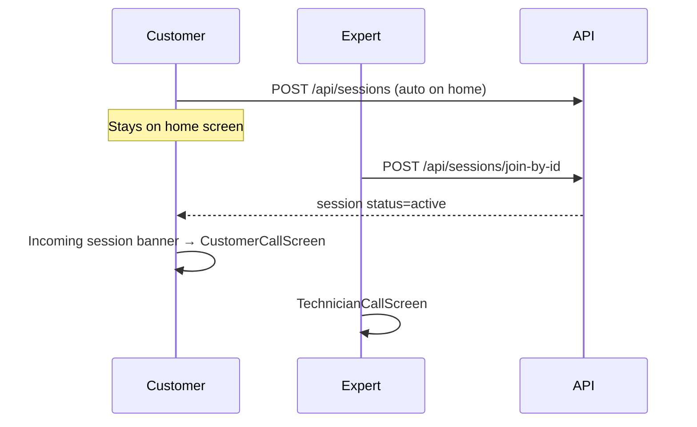

# AR Assist — App Flow (v3 — ID Join + Unified Home)

> End-to-end flows after Phase 7 home revamp.  
> **Last updated:** 2026-07-08

---

## 1. Authentication (unchanged)

```
Cold start → Splash → Google OAuth → Profile fetch (includes public_id)
    → Routes.HOME (unified home)
```

---

## 2. Unified Home (`AssistHomeScreen`)

### Top bar
- **AR Assist** logo + title
- **Customer / Expert toggle** (persisted in DataStore)
- Kebab menu: **Clear cache**, Debug backend URL, Sign out

### Customer mode
1. Shows formatted **11-digit ID** (`X-XXX-XXX-XXX`)
2. On home load, app **auto-creates a waiting session** in the background (customer stays on home)
3. **Share your ID** → opens system share sheet only (no navigation)
4. When expert joins: bottom bar shows **orange dot** + **"Incoming session connection"** → navigates to call
5. **Create video tutorial** → offline AR + screen recording (saved to phone)

### Expert mode
1. Enter / paste **11-digit customer ID**
2. **Join the session** → `POST /api/sessions/join-by-id` → Technician call screen (bottom sheet starts collapsed)

### Bottom status bar
- Connection / incoming-session dot + label
- **Wi-Fi icon** + battery percentage

---

## 3. ID-based session join



### Waiting screen (legacy route)
Still registered for deep links; **normal flow no longer navigates here** from Share your ID.

---

## 4. Call screen (shared core)

Both **Master** and **Instant** include:
- LiveKit AV + ARCore
- Annotation sidebar (pointer, arrow, draw, circle, undo, delete)
- 3D model library + placement (`place_model` realtime event)
- Mute + end controls

**Master only:** chat, files, recording, session menu, speaker, pause

---

## 5. Local video tutorial

```
Home → Create video tutorial
    → LocalTutorialScreen (ARCore, no backend session)
    → Start recording (MediaProjection)
    → End & save → MP4 in app storage
```

---

## 6. Debug backend URL

See [`debug-backend-url.md`](debug-backend-url.md).

---

## 7. Product tiers

See [`feature-matrix.md`](feature-matrix.md).
